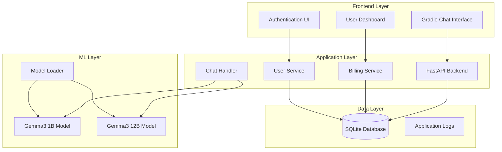

# Документ проектирования ML-чат сервиса с биллингом

## Обзор

ML-чат сервис представляет собой веб-приложение на базе Gradio, которое предоставляет доступ к двум локальным языковым моделям (Gemma3 1B и 12B) через чат-интерфейс с интегрированной системой биллинга. Система обеспечивает аутентификацию пользователей, управление кредитами и мониторинг использования.

## Архитектура

### Общая архитектура системы



### Технологический стек

- **Frontend**: Gradio 4.x с кастомными компонентами
- **Backend**: FastAPI + Uvicorn
- **ML Framework**: Transformers, PyTorch, BitsAndBytes (для квантизации)
- **Database**: SQLite с SQLAlchemy ORM
- **Authentication**: JWT + bcrypt
- **Logging**: Python logging + structured logs

## Компоненты и интерфейсы

### 1. Gradio Frontend Components

#### ChatInterface
```python
class ChatInterface:
    def __init__(self):
        self.chatbot = gr.Chatbot()
        self.msg_input = gr.Textbox()
        self.model_selector = gr.Radio(["Gemma3 1B", "Gemma3 12B"])
        self.credit_display = gr.HTML()
    
    def send_message(self, message: str, model: str, user_token: str) -> tuple
    def update_credits(self, user_token: str) -> str
```

#### AuthenticationInterface
```python
class AuthInterface:
    def __init__(self):
        self.login_form = gr.Column()
        self.register_form = gr.Column()
    
    def login(self, username: str, password: str) -> tuple[bool, str]
    def register(self, username: str, password: str, email: str) -> tuple[bool, str]
```

### 2. Backend API Services

#### UserService
```python
class UserService:
    def authenticate_user(self, username: str, password: str) -> Optional[User]
    def create_user(self, username: str, password: str, email: str) -> User
    def get_user_by_token(self, token: str) -> Optional[User]
    def update_user_credits(self, user_id: int, amount: int) -> bool
```

#### BillingService
```python
class BillingService:
    def charge_credits(self, user_id: int, amount: int) -> bool
    def add_credits(self, user_id: int, amount: int) -> bool
    def get_user_balance(self, user_id: int) -> int
    def log_transaction(self, user_id: int, amount: int, type: str) -> None
```

#### MLService
```python
class MLService:
    def __init__(self):
        self.models = {}
        self.load_models()
    
    def load_models(self) -> None
    def generate_response(self, prompt: str, model_name: str) -> str
    def get_model_cost(self, model_name: str) -> int
```

### 3. Model Management

#### ModelLoader
```python
class ModelLoader:
    def load_gemma3_1b(self) -> AutoModelForCausalLM
    def load_gemma3_12b_quantized(self) -> AutoModelForCausalLM
    def optimize_memory_usage(self) -> None
```

## Модели данных

### Схема базы данных

```sql
-- Пользователи
CREATE TABLE users (
    id INTEGER PRIMARY KEY AUTOINCREMENT,
    username VARCHAR(50) UNIQUE NOT NULL,
    email VARCHAR(100) UNIQUE NOT NULL,
    password_hash VARCHAR(255) NOT NULL,
    credits INTEGER DEFAULT 100,
    created_at TIMESTAMP DEFAULT CURRENT_TIMESTAMP,
    updated_at TIMESTAMP DEFAULT CURRENT_TIMESTAMP
);

-- Транзакции кредитов
CREATE TABLE credit_transactions (
    id INTEGER PRIMARY KEY AUTOINCREMENT,
    user_id INTEGER NOT NULL,
    amount INTEGER NOT NULL,
    transaction_type VARCHAR(20) NOT NULL, -- 'charge', 'add', 'refund'
    description TEXT,
    created_at TIMESTAMP DEFAULT CURRENT_TIMESTAMP,
    FOREIGN KEY (user_id) REFERENCES users(id)
);

-- Логи взаимодействий с моделями
CREATE TABLE model_interactions (
    id INTEGER PRIMARY KEY AUTOINCREMENT,
    user_id INTEGER NOT NULL,
    model_name VARCHAR(50) NOT NULL,
    prompt TEXT NOT NULL,
    response TEXT NOT NULL,
    credits_charged INTEGER NOT NULL,
    processing_time_ms INTEGER,
    created_at TIMESTAMP DEFAULT CURRENT_TIMESTAMP,
    FOREIGN KEY (user_id) REFERENCES users(id)
);

-- Сессии пользователей
CREATE TABLE user_sessions (
    id INTEGER PRIMARY KEY AUTOINCREMENT,
    user_id INTEGER NOT NULL,
    token_hash VARCHAR(255) NOT NULL,
    expires_at TIMESTAMP NOT NULL,
    created_at TIMESTAMP DEFAULT CURRENT_TIMESTAMP,
    FOREIGN KEY (user_id) REFERENCES users(id)
);
```

### Python модели данных

```python
from sqlalchemy import Column, Integer, String, Text, DateTime, ForeignKey
from sqlalchemy.ext.declarative import declarative_base

Base = declarative_base()

class User(Base):
    __tablename__ = 'users'
    
    id = Column(Integer, primary_key=True)
    username = Column(String(50), unique=True, nullable=False)
    email = Column(String(100), unique=True, nullable=False)
    password_hash = Column(String(255), nullable=False)
    credits = Column(Integer, default=100)
    created_at = Column(DateTime)
    updated_at = Column(DateTime)

class CreditTransaction(Base):
    __tablename__ = 'credit_transactions'
    
    id = Column(Integer, primary_key=True)
    user_id = Column(Integer, ForeignKey('users.id'))
    amount = Column(Integer, nullable=False)
    transaction_type = Column(String(20), nullable=False)
    description = Column(Text)
    created_at = Column(DateTime)

class ModelInteraction(Base):
    __tablename__ = 'model_interactions'
    
    id = Column(Integer, primary_key=True)
    user_id = Column(Integer, ForeignKey('users.id'))
    model_name = Column(String(50), nullable=False)
    prompt = Column(Text, nullable=False)
    response = Column(Text, nullable=False)
    credits_charged = Column(Integer, nullable=False)
    processing_time_ms = Column(Integer)
    created_at = Column(DateTime)
```

## Обработка ошибок

### Стратегия обработки ошибок

1. **Ошибки аутентификации**
   - Неверные учетные данные → HTTP 401
   - Истекший токен → HTTP 401 с перенаправлением на логин
   - Отсутствующий токен → HTTP 401

2. **Ошибки биллинга**
   - Недостаточно кредитов → Уведомление пользователя без обработки запроса
   - Ошибка транзакции → Откат операции, логирование ошибки

3. **Ошибки ML-моделей**
   - Ошибка загрузки модели → Fallback на доступную модель или уведомление
   - Недостаток памяти → Graceful degradation, предложение использовать меньшую модель
   - Timeout генерации → Прерывание запроса, возврат кредитов

4. **Системные ошибки**
   - Ошибки базы данных → Retry механизм, логирование
   - Сетевые ошибки → Retry с экспоненциальным backoff

### Логирование

```python
import logging
import structlog

# Структурированное логирование
logger = structlog.get_logger()

# Примеры логирования
logger.info("user_login", user_id=123, username="john_doe")
logger.error("model_loading_failed", model="gemma3_12b", error=str(e))
logger.info("credit_transaction", user_id=123, amount=-3, type="charge", model="gemma3_12b")
```

## Стратегия тестирования

### Unit Tests
- Тестирование сервисов (UserService, BillingService, MLService)
- Тестирование моделей данных
- Тестирование утилит и хелперов

### Integration Tests
- Тестирование API endpoints
- Тестирование взаимодействия с базой данных
- Тестирование аутентификации

### End-to-End Tests
- Тестирование полного пользовательского сценария
- Тестирование чат-интерфейса
- Тестирование биллинговых операций

### Performance Tests
- Нагрузочное тестирование ML-моделей
- Тестирование использования памяти
- Тестирование времени отклика

### Тестовые данные
```python
# Фикстуры для тестирования
@pytest.fixture
def test_user():
    return User(
        username="testuser",
        email="test@example.com",
        password_hash="hashed_password",
        credits=50
    )

@pytest.fixture
def mock_ml_service():
    service = MLService()
    service.models = {
        "gemma3_1b": MockModel("Fast response"),
        "gemma3_12b": MockModel("Detailed response")
    }
    return service
```

## Безопасность

### Аутентификация и авторизация
- JWT токены с коротким временем жизни (1 час)
- Refresh токены для продления сессии
- Хеширование паролей с bcrypt и солью
- Rate limiting для API endpoints

### Защита данных
- Валидация всех входных данных
- SQL injection защита через ORM
- XSS защита в Gradio компонентах
- HTTPS для production развертывания

### Мониторинг безопасности
- Логирование всех попыток аутентификации
- Мониторинг подозрительной активности
- Алерты при множественных неудачных попытках входа

## Производительность и масштабирование

### Оптимизация ML-моделей
- Квантизация Gemma3 12B до int4/int8
- Кеширование часто используемых промптов
- Batch processing для множественных запросов
- Lazy loading моделей при необходимости

### Оптимизация базы данных
- Индексы на часто запрашиваемые поля
- Connection pooling
- Периодическая очистка старых логов

### Мониторинг производительности
- Метрики времени отклика моделей
- Мониторинг использования памяти и CPU
- Трекинг пропускной способности системы